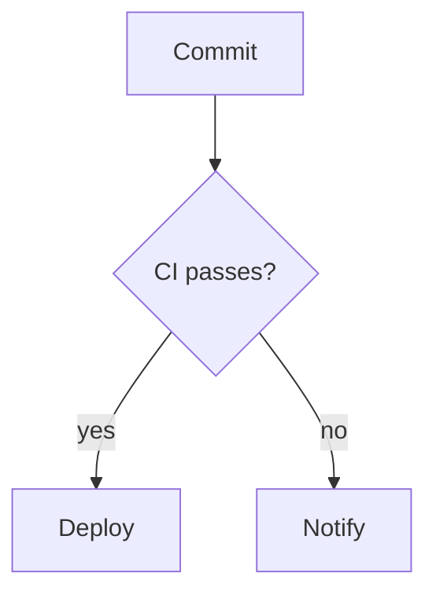

# Diagrams & Mermaid

Diagrams are usually the first thing lost when a page becomes Markdown. get-md handles Mermaid in four distinct ways, and it matters which one applies to your input:

- **Preserve** — a Mermaid fence that is already in the source comes out unchanged.
- **Recover** — a diagram that a browser already rendered to `<svg>` is turned back into a fence when the original source is still in the DOM.
- **Generate** — diagrams drawn into a PDF are reconstructed by a vision model. Opt-in, best-effort.
- **Validate** — every ` ```mermaid ` fence in the output is parsed, and invalid ones are flagged. Opt-in.

Preserve and recover are on by default and need no extra dependencies. Generate and validate are opt-in and each need extra packages.

## Support matrix

| Input | Diagram appears as | Result | Needs |
|-------|--------------------|--------|-------|
| HTML | `<pre><code class="language-mermaid">` | Preserved as a ` ```mermaid ` fence | — |
| HTML | `<pre class="mermaid">` with plain source text | Preserved as a ` ```mermaid ` fence | — |
| HTML | Rendered `<svg>` **with** the source still in the DOM | Recovered as a ` ```mermaid ` fence | — |
| HTML | Rendered `<svg>` with **no** recoverable source | Not recovered — the SVG's text labels fall through as loose text | — |
| Markdown | ` ```mermaid ` fence | Passed through untouched | `inputType: "markdown"` (see [below](#markdown-input)) |
| PDF | A drawn/vector diagram on the page | Reconstructed as a ` ```mermaid ` fence, best-effort | `useLLM` + a remote vision model + `pdfjs-dist` + `@napi-rs/canvas` |
| DOCX | Embedded image or drawing | Not reconstructed — vision reconstruction is PDF-only | — |

Everything except the PDF path runs offline with no extra setup. [`examples/mermaid-diagrams.ts`](https://github.com/Nano-Collective/get-md/blob/main/examples/mermaid-diagrams.ts) walks through preservation, recovery, and validation end to end:

```bash
npx tsx examples/mermaid-diagrams.ts
```

## Preserving existing fences

`mermaid` is a recognised language tag, alongside `dot`, `graphviz`, and `plantuml`. A tagged code block survives conversion with its fence and language intact — no options required.

```typescript
import { convertToMarkdown } from "@nanocollective/get-md";

const html = `
  <article>
    <h1>Deploy pipeline</h1>
    <p>The release flow is shown below.</p>
    <pre><code class="language-mermaid">graph TD
  A[Commit] --&gt; B{CI passes?}
  B --&gt;|yes| C[Deploy]
  B --&gt;|no| D[Notify]</code></pre>
  </article>
`;

const { markdown } = await convertToMarkdown(html, { includeMeta: false });
```

````markdown
# Deploy pipeline

The release flow is shown below.


````

The same holds from the CLI, for both HTML and Markdown files:

```bash
getmd https://example.com/architecture -o architecture.md
getmd notes.md -o notes.clean.md
```

### Markdown input

When you pass Markdown as a **string** to the library, get-md assumes HTML unless you say otherwise — a raw ` ```mermaid ` fence in an undeclared string will be escaped, not preserved. Declare the input type:

```typescript
// Either of these routes to the Markdown pipeline:
await convertToMarkdown(source, { inputType: "markdown" });
await convertToMarkdown({ type: "markdown", content: source });
```

The CLI detects `.md` files by extension, so `getmd notes.md` needs no flag.

## Recovering source from rendered diagrams

GitHub, MkDocs, Docusaurus and friends run mermaid.js in the browser, so the HTML you fetch often contains the *rendered* `<svg>` rather than the diagram source. get-md scans for mermaid containers before Readability extraction and HTML cleanup run — otherwise the diagram would be stripped as noise — and rewrites them back into a `language-mermaid` code block.

Containers it looks at:

`.mermaid` · `pre.mermaid` · `[data-processed="true"]` · `svg[id^="mermaid-"]` · `svg.mermaid`

For each one it takes the first source it can find, in this order:

1. A `<script type="text/mermaid">` inside the container, or as a sibling.
2. A `data-code`, `data-mermaid`, `data-src`, `data-original`, or `data-source` attribute.
3. The container's own text, when it's a `<pre>` that holds no `<svg>` (an unprocessed diagram).
4. A hidden `pre[hidden]`, `<template>`, or `textarea[hidden]`, inside or sibling.
5. The SVG's `<desc>`, `<title>`, or `aria-label` — but only when the text actually looks like Mermaid source.

That last check is deliberately strict: mermaid.js writes accessibility strings like `Created with Mermaid` into those nodes, and emitting one as a diagram would be worse than dropping it. Text qualifies only if it spans multiple lines, contains `;`, or starts with a diagram keyword (`graph `, `flowchart `, `sequenceDiagram`, `classDiagram`, `stateDiagram`, `erDiagram`, `gantt`, `pie`, `journey`, `gitGraph`, `mindmap`, `timeline`) *and* carries an arrow, a colon, or more than 20 characters.

```typescript
const html = `
  <div class="mermaid" data-processed="true"><svg id="mermaid-1">...</svg></div>
  <script type="text/mermaid">
    sequenceDiagram
      Alice->>Bob: Deploy request
      Bob-->>Alice: Ack
  </script>
`;

const { markdown } = await convertToMarkdown(html, { includeMeta: false });
// -> a mermaid-tagged fence containing the sequenceDiagram source
```

**When source is not recoverable**, the diagram is not reconstructed. The SVG's text labels flow into the output as ordinary text, so you get the node labels but not the structure. Client-side-rendered pages that keep no source in the DOM are the limiting case here — fetching the pre-render HTML (or the raw `.md` from the repo) is the reliable fix.

## Reconstructing diagrams from PDFs

A diagram in a PDF is vector drawing or a raster image — there is no text source to recover, so this path is a vision problem. get-md renders PDF pages to images and asks a vision-capable model to emit Mermaid inline where the diagram appeared. Treat it as a best-effort assist, not guaranteed fidelity.

### Setup

The renderer relies on two optional peer dependencies:

```bash
npm install @nanocollective/get-md pdfjs-dist @napi-rs/canvas
```

Then convert with `useLLM` and a **remote, vision-capable** model:

```typescript
import { readFileSync } from "node:fs";
import { convertToMarkdown } from "@nanocollective/get-md";

const { markdown } = await convertToMarkdown(readFileSync("handbook.pdf"), {
  useLLM: true,
  llm: {
    sdkProvider: "google",
    model: "gemini-2.5-flash",
    apiKey: process.env.GOOGLE_GENERATIVE_AI_API_KEY,
  },
  validateMermaid: true, // optional: flag anything the model got wrong
});
```

Or from the CLI:

```bash
getmd handbook.pdf --use-llm \
  --llm-provider google \
  --llm-model gemini-2.5-flash \
  --llm-api-key "$GOOGLE_GENERATIVE_AI_API_KEY" \
  --validate-mermaid \
  -o handbook.md
```

See [Remote LLM Providers](./remote-llm.md) for the full provider configuration, including config files and `${ENV_VAR}` substitution.

### Limits and failure modes

- **Remote providers only.** The local ReaderLM-v2 path (`sdkProvider: "local-llama"`, and the `useLLM` default when no `llm` config is given) is text-only. No images are rendered and no diagrams are reconstructed.
- **First 10 pages only.** Rendering every page of a long PDF would overflow the model's context, so page rendering is capped at 10. Longer PDFs log a warning naming the cap; text extraction still covers the whole document.
- **Fails soft, twice.** If `pdfjs-dist`/`@napi-rs/canvas` are missing or rendering throws, get-md warns and continues without images. If the vision request itself fails, it retries the same conversion text-only. Either way you get Markdown, just without reconstructed diagrams.
- **Accuracy varies** with the model and the diagram. Dense or hand-drawn diagrams degrade first. Pair this with validation.
- **With `useLLM` off, nothing changes** — the default fast path never renders pages and never calls a model.

## Validating generated Mermaid

A model can emit Mermaid that looks right and doesn't parse. `validateMermaid: true` runs every ` ```mermaid ` fence in the final Markdown through mermaid's own parser and annotates the ones that fail.

Install the optional peer dependency:

```bash
npm install mermaid
```

```typescript
const { markdown } = await convertToMarkdown(source, {
  inputType: "markdown",
  validateMermaid: true,
});
```

From the CLI, or in a config file:

```bash
getmd notes.md --validate-mermaid -o notes.checked.md
```

```json
{
  "validateMermaid": true
}
```

Invalid blocks are **kept**, with a GitHub-style callout inserted above them, so you can repair them by hand rather than losing the content:

````markdown
> [!WARNING]
> Invalid Mermaid syntax: Parse error on line 3:

```mermaid
graph TD
  A -->
```
````

Notes:

- Validation applies to *all* Mermaid in the output — preserved, recovered, and generated alike — not only LLM output.
- It runs last, after conversion and image localization.
- **If `mermaid` isn't installed**, get-md logs a warning and returns the Markdown unchanged. Enabling the option can't break a conversion.
- Only non-indented triple-backtick fences are matched. Indented fences may pass through unvalidated.
- `mermaid` is a large browser-oriented package. Install it where you want the check, not by default.

## Troubleshooting

| Symptom | Likely cause |
|---------|--------------|
| Fence came out escaped, with backslashes before the backticks | A Markdown string was passed without `inputType: "markdown"` |
| Diagram became loose text labels | Page shipped only rendered SVG with no source in the DOM |
| PDF produced no diagrams | `useLLM` off, a `local-llama` provider, missing `pdfjs-dist`/`@napi-rs/canvas`, or the diagram sat past page 10 |
| `validateMermaid` flagged nothing on a broken diagram | `mermaid` not installed (check for the warning), or the fence is indented |

## See Also

- [Remote LLM Providers](./remote-llm.md) — Provider setup for the PDF vision path
- [LLM Conversion](./llm-conversion.md) — The local ReaderLM-v2 path (text-only)
- [convertToMarkdown](../api/convert-to-markdown.md) — Full options reference
